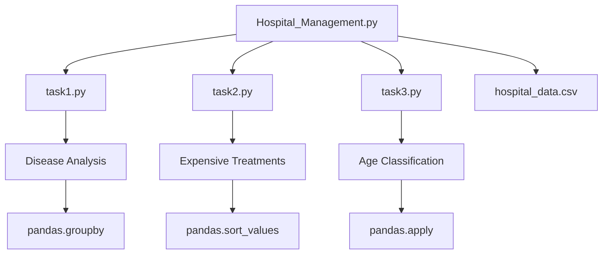

<div align="center">

# 🏥 Hospital Patient Data Analysis System

[](https://python.org)
[](https://pandas.pydata.org)
[](LICENSE)
[]()

*A comprehensive Python-based data analysis system for hospital patient management and treatment cost analysis*

[Features](#-features) • [Installation](#-installation) • [Usage](#-usage) • [Documentation](#-documentation) • [Team](#-team-members)

</div>

---

## 📊 About This Project

The **Hospital Patient Data Analysis System** is a modular Python application designed to analyze patient demographics, treatment costs, and medical data patterns. Built with a focus on simplicity and educational value, this system demonstrates core data science concepts using real-world healthcare scenarios.

### 🎯 Project Objectives
- Analyze treatment cost patterns across different diseases
- Identify high-cost medical treatments and patient demographics
- Classify patients into meaningful age groups for targeted analysis
- Demonstrate pandas data manipulation and analysis techniques

---

## ✨ Features

### 🔍 **Data Analysis Capabilities**
- **Disease Cost Analysis**: Calculate average treatment costs by disease type
- **Expensive Treatment Identification**: Find and rank the most costly treatments
- **Age Group Classification**: Categorize patients using custom classification logic
- **Interactive Menu System**: User-friendly command-line interface
- **About Project**: Project details and team information

### 📈 **Technical Highlights**
- **Modular Architecture**: Separated into focused, reusable components
- **Clean Code Structure**: Beginner-friendly with clear function separation
- **Real Dataset**: 15 patient records with authentic Indian demographics
- **Pandas Integration**: Leverages powerful data manipulation capabilities

---

## 🛠️ Technologies & Libraries

<div align="center">

| Technology | Version | Purpose |
|------------|---------|---------|
|  | 3.8+ | Core Programming Language |
|  | Latest | Data Analysis & Manipulation |
|  | Latest | Numerical Computing Support |

</div>

---

## 📁 Project Structure

```
Hospital_management/
├── 📄 Hospital_Management.py     # Main application entry point
├── 📄 task1.py                   # Disease cost analysis module
├── 📄 task2.py                   # Expensive treatments module  
├── 📄 task3.py                   # Age group classification module
├── 📊 hospital_data.csv          # Patient dataset (15 records)
├── 📋 requirements.txt           # Python dependencies
└── 📘 README.md                  # This file
```

### 🏗️ Architecture Overview



---

## 🚀 Installation

### Simple 3-Step Setup
```bash
# 1. Clone the repository
git clone https://github.com/yourusername/hospital-patient-analysis.git
cd hospital-patient-analysis

# 2. Install requirements
pip install -r requirements.txt

# 3. Run the program
python Hospital_Management.py
```

---

## 💻 Usage

### Starting the Application
```bash
python Hospital_Management.py
```

### Menu Options
```
HOSPITAL MANAGEMENT SYSTEM
==================================================
1. View All Data          # Display complete patient dataset
2. Disease Analysis       # Average costs by disease type
3. Expensive Treatments   # Top 5 most costly treatments
4. Age Groups            # Patient classification by age
5. About Project         # Project and team information
6. Exit                  # Close application
==================================================
```

### Sample Output
```bash
TASK 1: DISEASE COST ANALYSIS
==================================================
Average Cost by Disease:
Cancer: Rs. 88,500
Heart Disease: Rs. 70,000
Diabetes: Rs. 16,500
Pneumonia: Rs. 13,000
Asthma: Rs. 7,250
Flu: Rs. 2,000

Most Expensive: Cancer
Least Expensive: Flu
```

---

## 📊 Dataset Information

### Patient Demographics
- **Total Records**: 15 patients
- **Age Range**: 8-76 years
- **Geographic Focus**: Indian patient names and demographics
- **Cost Range**: ₹1,500 - ₹92,000

### Medical Conditions Covered
| Disease | Avg. Cost | Patients |
|---------|-----------|----------|
| Cancer | ₹88,500 | 2 |
| Heart Disease | ₹70,000 | 3 |
| Diabetes | ₹16,500 | 3 |
| Pneumonia | ₹13,000 | 2 |
| Asthma | ₹7,250 | 2 |
| Flu | ₹2,000 | 3 |

---

## 📚 Documentation

### Key Learning Concepts
- **Data Loading**: CSV file handling with pandas
- **Data Grouping**: Using `groupby()` for categorical analysis
- **Data Sorting**: Implementing `sort_values()` for ranking
- **Custom Functions**: Creating and applying user-defined functions
- **Modular Programming**: Separating concerns across multiple files


---

## 👥 Team Members

<div align="center">

### 🎓 **Development Team**

</div>

| Developer | Module | Contributions |
|-----------|--------|---------------|
| **Mangesh Choudhary** | Hospital_Management.py | Main program and menu system |
| **Riya Singh** | task1.py | Disease analysis and cost calculations |
| **Ayush Raybhar** | task2.py | Expensive treatments identification |
| **Sean Ambrose** | task3.py | Age group classification system |

---

<div align="center">

### 🌟 **Star this repository if you found it helpful!** 🌟

**Made with ❤️ by Team Hospital Management**

[⬆ Back to Top](#-hospital-patient-data-analysis-system)

</div>
